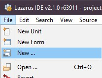

# castle-editor-tutorial

## Abstract

A Castle Editor tutorial, that shows how to create and use Castle User Interface.

## Set up environment

For this tutorial we shall be using Lazarus IDE. We shan't use GUI provided by Lazarus, therefore this is not a requirement, just a personal preference. You can easily follow this tutorial in any other IDE capable of editing FreePascal code.

Before we start:

* Make sure that Lazarus + FPC are properly installed.

* Make sure Castle Game Engine packages are installed, compiled and working properly. We shall be using `castle_base.lpk` and `castle_window.lpk` packages. Try compiling a few examples from `examples` folder to make sure they're working

* Make sure that `alternative_castle_window_based_on_lcl.lpk` is _**NOT**_ installed in Lazarus, as it will conflict with window package we shall be using.

* Make sure system environment variables required for Castle Game Engine are set up properly.

* Make sure Castle Editor is compiled and ready to use.

## Creating a base project

@michaliskambi, _note, I've never ever been able to setup the environment variables correctly, and generating a new project from a template never worked for me neither on Linux or on Windows. So I'm cheating here - I'm creating the project in Lazarus. You may want to change this chapter for a better, Castle Engine based approach._

In Lazarus press 

