# Tutorial: Creating a simple clicker game in Castle Game Engine and Castle Editor

## Abstract

This tutorial is aimed at new users, who have some minor knowledge of Pascal and general concepts of programming and game development. It will cover all steps necessary from creation and setting up of the project, to a small but finished game.

## Set up environment

For this tutorial we shall be using Lazarus IDE. We shan't use GUI provided by Lazarus, therefore this is not a requirement, just a personal preference. You can easily follow this tutorial in any other IDE capable of editing FreePascal code.

Before we start:

* Make sure that Lazarus + FPC are properly installed.

* Make sure Castle Game Engine packages are installed, compiled and working properly. We shall be using `castle_base.lpk` and `castle_window.lpk` packages. Try compiling a few examples from `examples` folder to make sure they're working

* Make sure that `alternative_castle_window_based_on_lcl.lpk` is _**NOT**_ installed in Lazarus, as it will conflict with window package we shall be using.

* Make sure system environment variables required for Castle Game Engine are set up properly.

* Make sure Castle Editor is compiled and ready to use.

## Creating a base project

@michaliskambi, _I've never ever been able to setup the environment variables correctly, and generating a new project from a template never worked for me neither on Linux nor on Windows. Therefore I'm cheating here - I'm creating the project in Lazarus and copy files from Castle Editor templates. Please, double-check if it makes sense._

Run Castle Editor and select "New Project":


In this tutorial we'll be using the most basic template - "Empty". Write a name for the project and press "Create Project" button. Note that the name cannot start with a number. And it's best to avoid non-ASCII characters or spaces in project name or path.


This will create a simple dummy project we can start filling with our game-specific code and assets.

Let's open freshly created `ButtonClickerGame.lpi` in Lazarus. We can immediately compile and run it. As it is a template, it's a fully functional minimalistic project, that will show us an empty dark gray window with a lone FPS counter. No, Empty project is not actually empty, but it contains:

- `ButtonClickerGame.lpi` - Lazarus project file. It is created and maintained automatically by Lazarus.

- `ButtonClickerGame.lpr` - a program initialization file, that was automatically created for us by Castle Editor and we don't need to change anything in there, maybe only update the proper game version as we would be working on it. You can open it in Lazarus or any text editor. `lpr` stands for "Lazarus project" but in everything else it's equal to a normal `pas` file.

- `CastleEngineManifest.xml` - a Castle Game Engine manifest file, that describes some important settings for the project that control how the project is compiled, packaged and distributed. For now we don't need to change anything inside.

- `gameinitialize.pas` - pascal unit for initialization of the game.

- `gamestatemain.pas` - pascal unit for Main State of the User Interface. It describes how this State should work.

- `data` folder, that contains game data. For now it's almost empty and contains only:

- - `CastleSettings.xml` - settings of our game project.

- - `state_main.castle-user-interface` - design of the Main State. We can edit it with Castle Editor.

- - `README.txt` - short reminder of what the `data` folder is and where to get additional information. We don't need this file and it can be deleted right away.

Before we finish this part, let's also update some settings in Lazarus for convenience of our future work.

Firs of all, we may want to have all the project units listed in Project Inspector. We can do that either by simply dragging them from the folder, or by pressing "Add" button.

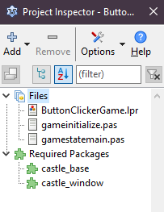

If the Project Inspector is not visible on the screen, we may show it by going to Project -> Project Inspector menu:

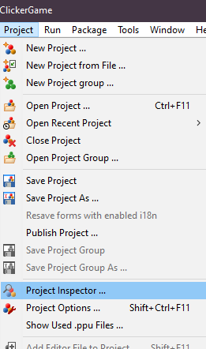

Note, that the required packages `castle-base` and `castle-window` are already included as dependencies of our project.

Next let's tweak a couple of Project Options, which can be found in Project -> Project Options:

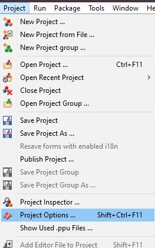

First of all, let's go to Project Options -> Miscellaneous and uncheck option "Main unit has Uses section containing all units of project". This will ensure our `lpr` file won't get spammed by all units we add to the game, and avoid compilation problems if we decide to rename our units at some point.

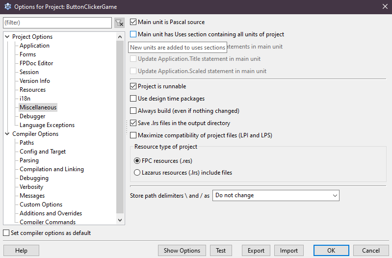

Now let's go to any submenu of "Compiler Options" and click "..." button near "Build Modes: Default".

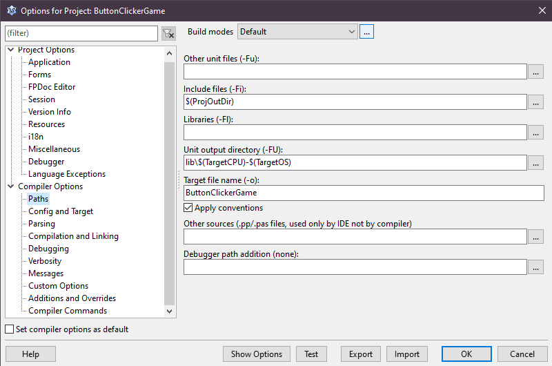

And there press the button "Create Debug and Release modes".

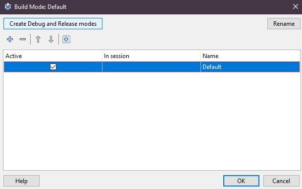

Now our "Build Modes" screen should look like this:

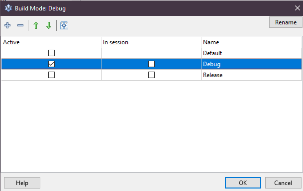

It is important to work on a project in "Debug" mode - which was conveniently autoselected for us already. Debug mode adds a lot of additional checks, that can really help with debugging the game, and also will report memory leaks if any.

Obviously, such additional checks slow down the program, so when we are satisfied with the result and are releasing the game to the world, we need to use "Release" mode, which will work faster.

Now we can close both "Build Modes" and "Project Options" windows by pressing OK (to save the changes) and we can go a bit deeper.

## Deleting a State

**State** is one of the game's view, like Main menu, Gameplay view, High scores, maybe some different States, like Inventory, Achievements, differnt gamemodes, etc.

As we noted above the "Empty" template is not actually empty - it already contains a Main State with a FPS label. We could have cleaned those up and reused, but we might want to use this opportunity to learn how to delete a state.

Simply deleting `state_main.castle-user-interface` and `gamestatemain.pas` is not enough, as they are referenced from within our game. Let's look more closely at our `gameinitialize.pas`. What we are interested in is the procedure `ApplicationInitialize`.

As you can see it will be called when the application (our game) will start up:

```Pascal
initialization
  ...
  Application.OnInitialize := @ApplicationInitialize;
```

That is this procedure contains everything that happens during the game startup - usually loading of game data and initialization of game States. Let's see what we have there right now (comments are removed for more compact view):

```Pascal
procedure ApplicationInitialize;
begin
  Window.Container.LoadSettings('castle-data:/CastleSettings.xml');

  StateMain := TStateMain.Create(Application);
  TUIState.Current := StateMain;
end;
```

So, first of all, we load `CastleSettings.xml` file by calling `Window.Container.LoadSettings`. It will set up our Window parameters. We could do this here by manually setting `Window` properties that we need to change from default, but having a `CastleSettings` file is usually more convenient and flexible. Moreover, it allows Castle Editor to know more about how our game should look like.

The next line `StateMain := TStateMain.Create(Application);` creates a singleton for `TStateMain` - the class that manages our Main State. Inside `GameStateMain` unit you can see that the class API (`interface`), `implementation` and also declaration of the singleton variable:

```Pascal
var
  StateMain: TStateMain; 
```

Next we set our `StateMain` as the `Current` state by calling `TUIState.Current := StateMain;`. 

We shall create our own states in the very same way, but for now we are going to delete this state. This means we need to delete files `state_main.castle-user-interface` and `gamestatemain.pas` and remove the state initialization from `gameinitialize.pas`.

Now our `ApplicationInitialize` will look like:

```Pascal
procedure ApplicationInitialize;
begin
  Window.Container.LoadSettings('castle-data:/CastleSettings.xml');
end;
```

and we also should adjust our `uses` section to remove the reference to `GameStateMain` unit. That would be just changing:

```Pascal
uses SysUtils,
  CastleWindow, CastleScene, CastleControls, CastleLog, CastleFilesUtils,
  CastleUIControls, CastleApplicationProperties, CastleUiState
  GameStateMain;
```

into

```Pascal
uses SysUtils,
  CastleWindow, CastleScene, CastleControls, CastleLog, CastleFilesUtils,
  CastleUIControls, CastleApplicationProperties, CastleUiState;
```

Note that we also silently deleted a few other unused units from `uses` section, when you create a project from `Empty` template you may have a little more units there, but Lazarus will notify you in "Messages" window, that some units aren't used in the project:


It's very reasonable to check "Messages" from time to time to see if Lazarus hints us to change something, usually it's quite useful.

Now it's time to physically delete the files `state_main.castle-user-interface` and `gamestatemain.pas` - with any convenient file explorer.

Note, that in case we've added `gamestatemain.pas` to our Project Inspector earlier, it will now complain that the file is missing:

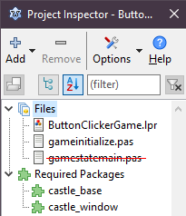

It won't trigger an error or any other trouble, but we also should remove it by right clicking it and selecting "Remove":

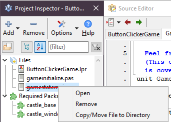

Of course we can also use "Remove" button which is located above.

Now let's try to compile and run our project. We have a perfectly clean, truly "Empty" window. In case we missed some of the references to the deleted unit, we may run into compilation errors which in this case should be easy to fix, but after going through all the process above - we're all good and ready to start working!

## Creating a Main Menu State

### Create empty State

Make sure Castle Engine is running and our project is open. If not, then it's easy to open it by:

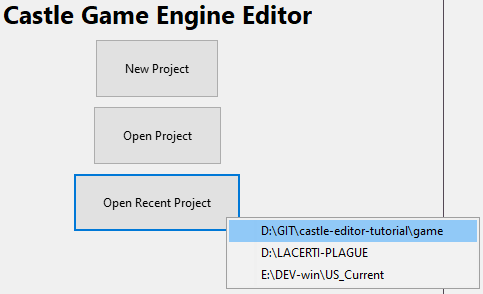

After the project opens we see the Castle Editor Designer window:

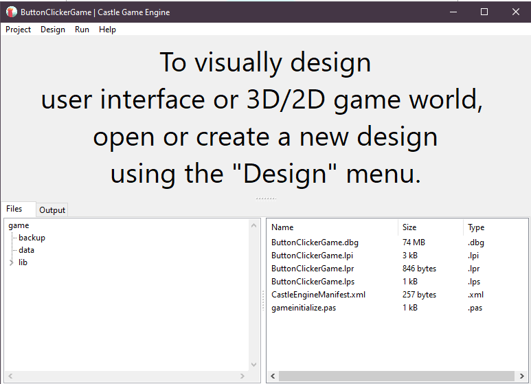

Let's create our new state. There are many different user interface elements we can use as a root, but usually it's most convenient to have either Empty rectangle as root, or a specific user interface we are going to use. In this case let's create a State based on "Image (TCastleImageControl)" - so that we shall have an image for background.

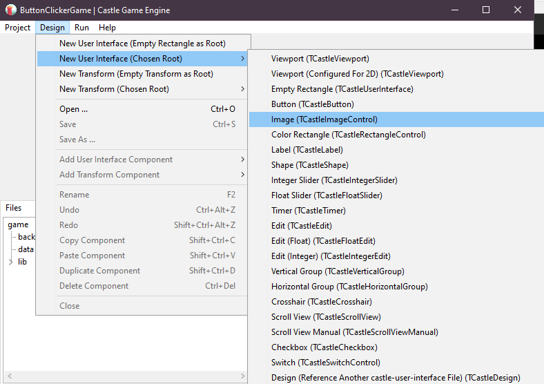

Now our window should look like this:

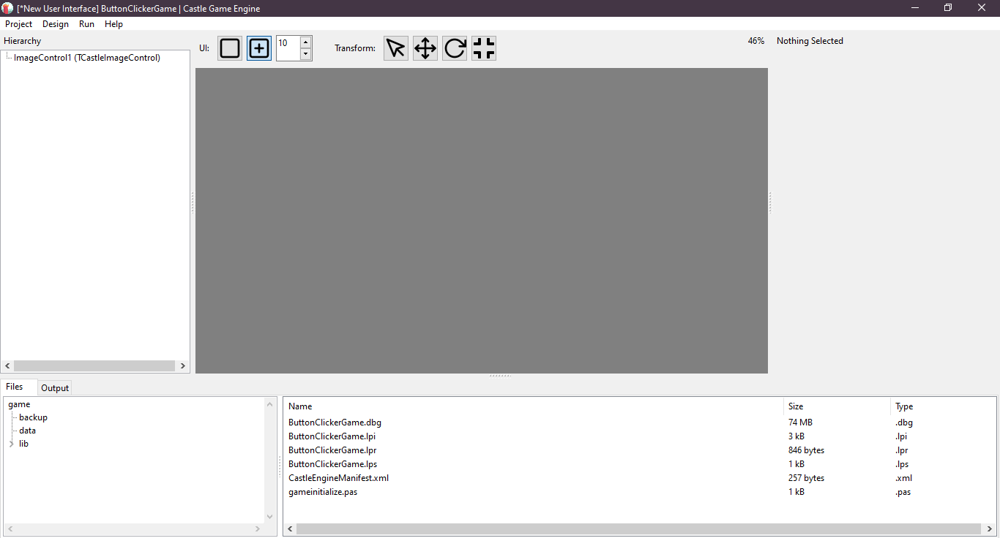

### Create background image

On the left we see a "Hierarchy" - this is the tree of User Interface elements that are present within our State currently. For now it's only `ImageControl`. Let's select it by left-clicking in Hierarchy. Now on the right side we have a way to edit the properties of our user interface element:

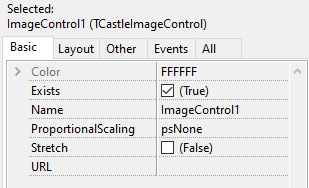

Let's change the `Name` field to "BackgroundImage" and select the actual image to display by clicking the `URL` field and then the button with three dots:

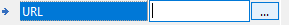

It will open the `data` folder of our project prompting us to select an image. All of our game data should be stored in this folder, so let's use our file manager to drop some assets there. For now let's add `images` subfolder and drop our background image there. Then our open window will look like this:

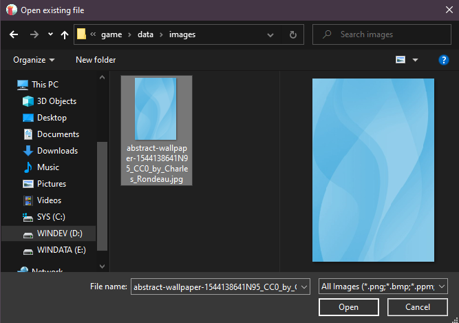

Let's select the background image and press "Open". We immediately see the image in our State:

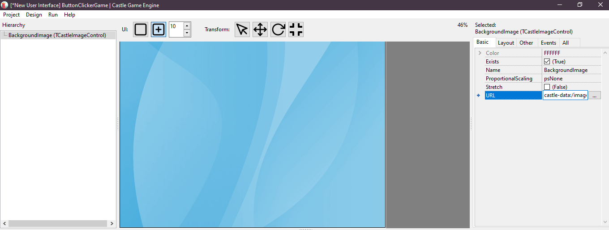

However, it doesn't seem to be exactly what we want - to behave as a background image, i.e. to fill the entire screen. To improve this behavior we need to go to "All" tab in properties of our ImageControl and set FullSize property to true:

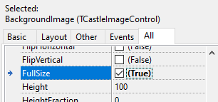

This will make our background image stretch horizontally and vertically to fill the entire parent User Interface. As this is our topmost user interface - it'll fill the entire window, which is exactly what we want here. Now our background behaves as we intend it to:

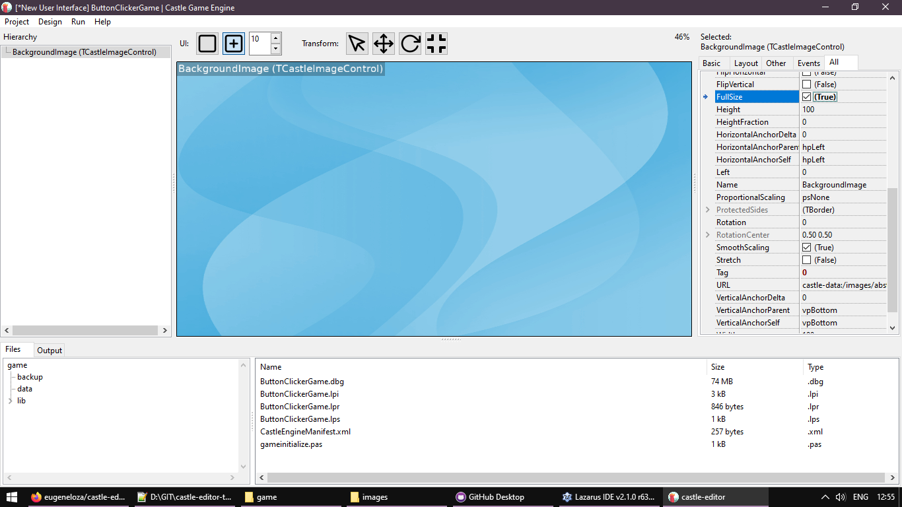

### Save State

As Castle Editor doesn't support backups and autosaving yet, we should get a habit of saving our work often - and it's a good habit anyway. To do this we press Design -> Save (or Save As):

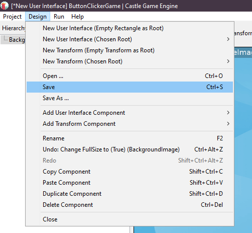

Let's name our state "MainMenu" and press "Save":

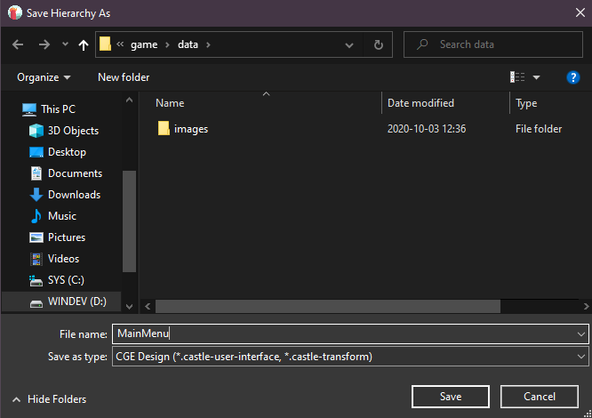

### Create Logo image

In simple words, Main Menu is a game logo + a set of buttons that would allow the player to start the game, change options, see credits, etc.

So first of all we add a logo of our game. The process is very similar to the one that we've been following when creating the empty State, but this time instead of creating a new State, we use Design -> Add User Interface Component like this:


And select an "Image (TCastleImageControl)". In the same way as we did with the background now we pick `images/buttonclickerlogo.png` as the image file. And our image is ready in our user interface:

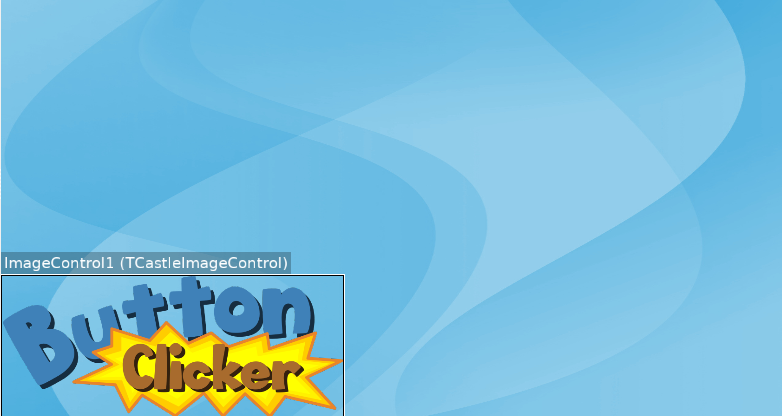

Now we should position it in the upper center of our design. To do that we use "Layout" tab of the Castle Editor:

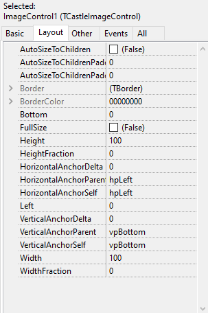

Let's set `HorizontalAnchorParent` (i.e. to which side of the Parent (currently that is `BackgroundImage`) we align our interface element) and HorizontalAnchorSelf (which side of this user interface element is aligned) both to `hpMiddle` (which stands for "horizontal position - Middle). And `VerticalAnchorParent` and `VerticalAnchorSelf` to `vpTop` (which stands for "vertical position - Top"). Now we should have something like:

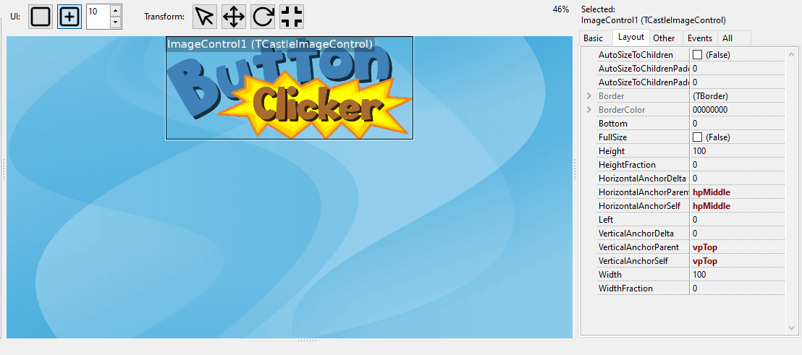

Note, that the values we've changed from the default ones are highlighted in bold and dark red color.

Now we have a small detail - our logo is glued to the top of the design, which is not nice. We need to add a gap, which we can do by changing `VerticalAnchorDelta` property of our logo image. As we are moving the image _down_ we have to specify a _negative value_ here, let's say "-50". Now our image has some free space around it in the design:

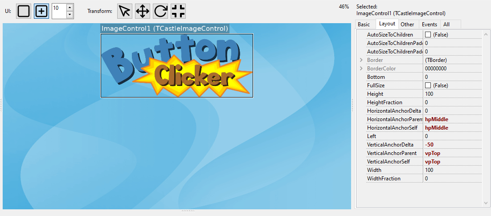

The same way if we'd wanted to move the image horizontally from the anchor, we'd have had to modify `HorizontalAnchorDelta` property.

Let's rename this logo image into `LogoImage` and we're done here.

Note, that as we never explicitly set the size of the image, it will have its native dimensions of 740x310.

### Create menu buttons

Next we need to create the actual menu buttons. This is a vertically-aligned set of similar items, which should make use of automatic arrangement, so that we shall have no problems adding/removing the buttons in future. This part is covered by "Vertical Group" UI element. We can add it by Design -> Add User Interface Component -> Vertical Group (TCastleVerticalGroup). Note, that first we should select the User Interface Component to which we add it - and it should be our `BackgroundImage`.

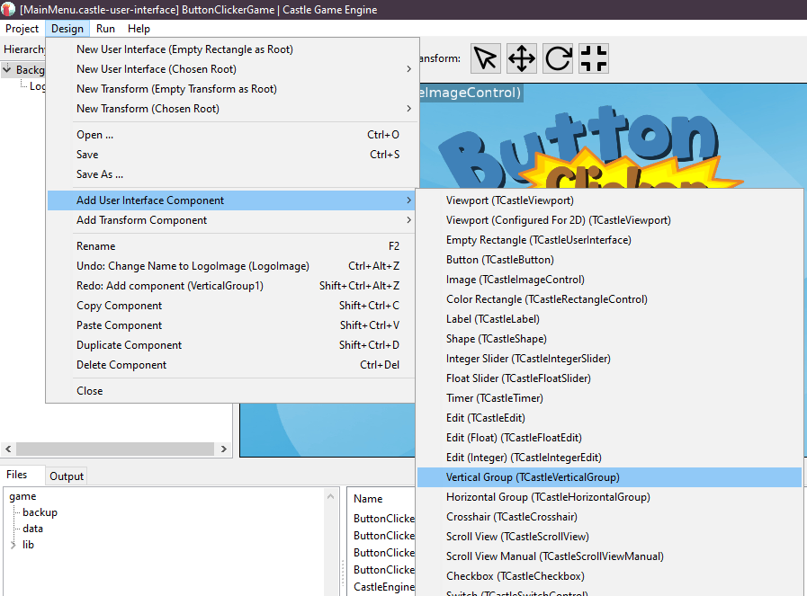

Note, the item appearing in our design hierarchy:

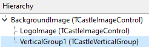

Now, we already know how to change this component's name to `MenuGroup`. Let's align it to the center of our design in a similar way how we aligned the logo, but this time using `hpMiddle` and `vpMiddle` anchors:

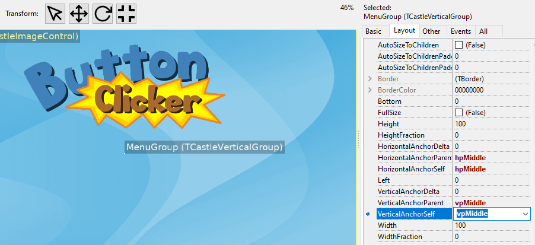

Now it's time to add our menu buttons to the Vertical Group. Select `MenuGroup` and add a button by Design -> Add User Interface Component -> Button (TCastleButton) and name it `StartGameButton`:

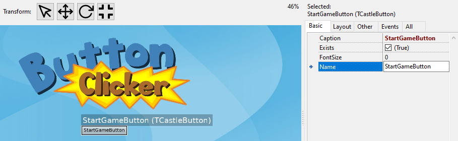

Now before adding other buttons, let's fix its design. First of all let's assign a proper `Caption` to the button: `Start`.

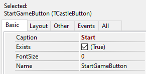

Then we want to have some nicely designed image for the button instead of standard box button image. This can be done in "All" tab by modifying "CustomBackground" properties:

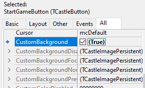

First we should tick the "CustomBackground" checkbox and next let's click `CustomBackgroundNormal`:

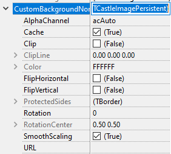

It's easy to see, that it looks very similar to how we were working with `TCastleImageControl` as both are using `TCastleImage` class underneath. For now we are interested in `URL` property - let's add an image here just like we did before for background and logo. The same way let's add URLs of images to `CustomBackgroundPressed` (this will be the image displayed when user presses the button) and `CustomBackgroundFocused` (the image displayed when the user hovers the mouse pointer over the button).

Now the button should look like this:

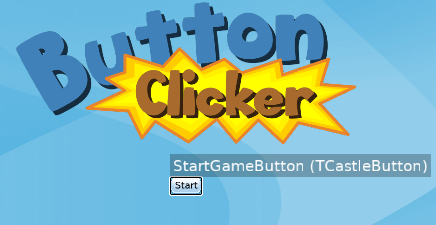

However, the button is too small, let's go to "Layout" tab and uncheck the `AutoSize` property:

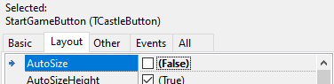

Now the button fits in a 100x100 square:

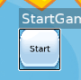

Now the button has size of `Width` and `Height` specified in the same tab. Let's change those values to 406x160:

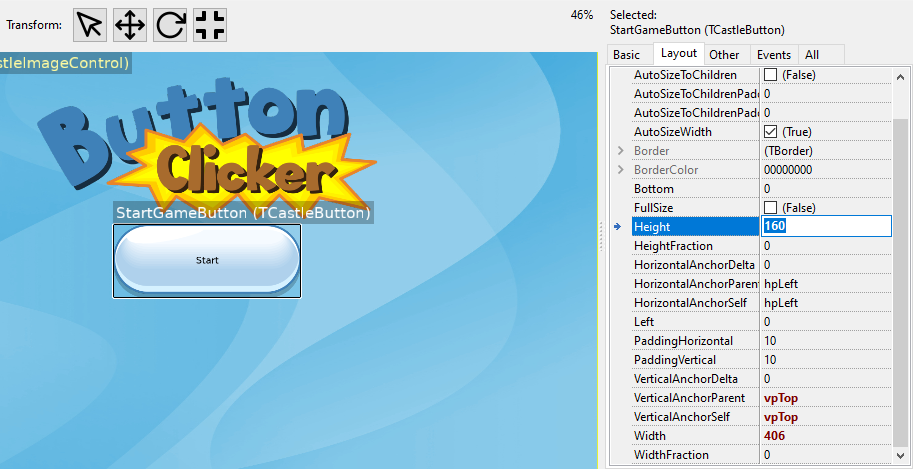

Also let's change the font size, so that the text won't be so tiny. It can be done in "Basic" tab:

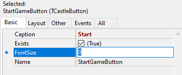

Zero means "default" value, we'll learn to change it later. For now let's assign it to 60:


Now, to avoid going through all this process again, we can just create copies of our already designed button. Let's select it and press Design -> Duplicate Component:

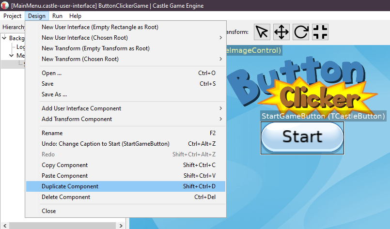

Now we have two identical buttons in the design. Let's create two more the same way, so that we have four buttons in total:

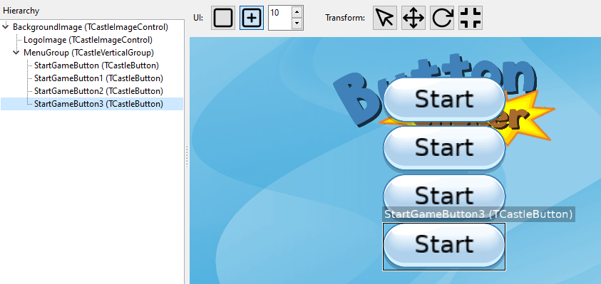

Let's name the second button `OptionsButton` and set its caption "Options", then `CreditsButton` and set its caption "Credits" and finally `QuitButton` with "Quit" caption:

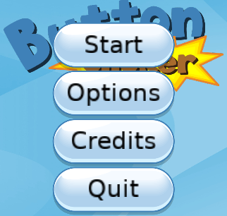

And as a final touch let's add some spacing between the buttons by selecting `MenuGroup` and changing `Spacing` property in "Basic" tab:

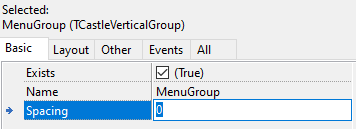

Let's set it to 20 and we're done with this part:

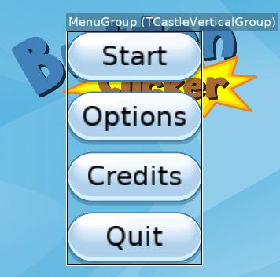

### Screen aspect ratio and orientation

Obviously we have a problem that the buttons overlap with the game title. This happens because our current view has proportions of Landscape orientation, but we are aiming at mobile devices in Portrait orientation, which would define our design arrangement, but still the variety of mobile devices resolutions and aspect ratio is extremely high, and we have to make our interface flexible enough to fit most if not all of them. Fortunately, Castle Game Engine does most of this dirty work for us.

There are several steps to fix this problem, but first of all, let's go to the settings file `CastleSettings.xml` and look inside. It contains the following lines:

```XML
<castle_settings>
  <ui_scaling
    mode="EncloseReferenceSize"
    reference_width="1600"
    reference_height="900"
  />
</castle_settings>
```

Let's set it to the ones specific to iPhone 6, 6s, 7 and 8 in Portrait orientation:

```XML
reference_width="750"
reference_height="1334"
```

This will tell the engine that it should consider that all the internal designs of the game are designed for 750x1334 screen. The actual values don't really matter, as we try to aim at diverse possible screen ratios, it's just something that the game engine will take as reference.

Note that setting `reference_width` and `reference_height` doesn't enforce the actual screen size, so in case of Desktop application we should do it manually. Let's open `GameInitialize` unit and add the following lines in the very end of `initialization` section, right before the `end.`:

```Pascal
{$ifndef CASTLE_IOS}
  {$ifndef ANDROID}
    Window.Height := Application.ScreenHeight * 5 div 6;
    Window.Width := Window.Height * 750 div 1334;
  {$endif}
{$endif}
```

Here we set the `Window.Height` based on current monitor resolution `Application.ScreenHeight` - to fit almost all the screen height, and then scale `Window.Width` accordingly to our 750x1334 reference screen size.

`{$ifndef CASTLE_IOS}...{$endif}` and `{$ifndef ANDROID}...{$endif}` are compiler directives that tell the Free Pascal compiler not to set `Window.Width` and `Window.Height` for Android and iOS devices.

Now we can try and compile the game to see that our window is now has a correct shape in Portrait orientation.

Let's also add one important touch here, so that when we would want to compile for mobile platforms, our game will tell the device that it wants to run only in Portrait mode. Let's open `CastleEngineManifest.xml` and add a line `screen_orientation="portrait"` somewhere in `project` tag, e.g. after `caption` field. So now it will look something like this:

```XML
<project name="ButtonClickerGame"
  standalone_source="ButtonClickerGame.lpr"
  game_units="GameInitialize"
  qualified_name="io.castleengine.ButtonClickerGame"
  caption="Button Clicker"
  screen_orientation="portrait"
>
</project>
```

Now let's close our project and reopen it again in Castle Editor, so that our changes to `CastleSettings.xml` would take effect. Let's open our MainMenu design again by choosing Design -> Open, selecting `MainMenu.castle-user-interface` file and clicking "Open". Now the Main Menu immediately looks better even though Castle Editor window is still in Landscape orientation:

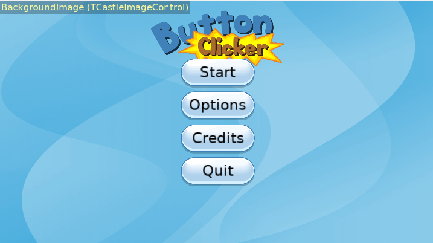

However, the buttons are still covering our logo a bit, and there is too much asymmetric free space below. This happened because we aligned our Vertical Group exactly at the center of the screen. There are many different ways to fix this issue, but in the current design we can cheat a bit.

As we already have the Vertical Group, let's just add our logo to it, so that it will be arranged the same way as the buttons. To do that, just click the `LogoImage` in the Hierarchy and drag it into the `MenuGroup`:

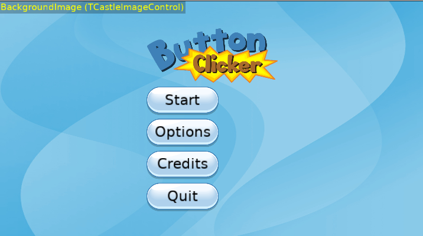

Now the whole Logo + Menu buttons construction is properly aligned to the screen center vertically and horizontally, but they aren't aligned to each other. It's fixed by selecting `MenuGroup` and going into "All" tab:

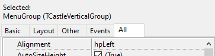

Let's edit `Align` property and change it from `hpLeft` (which means all the elements in the Vertical Group are aligned by their left border) to `hpMiddle` (which means all the elements in the Vertical Group are aligned to middle). And everything looks cool now:

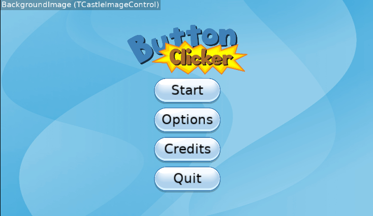

Now we can try changing the screen aspect ratio by dragging these separators:

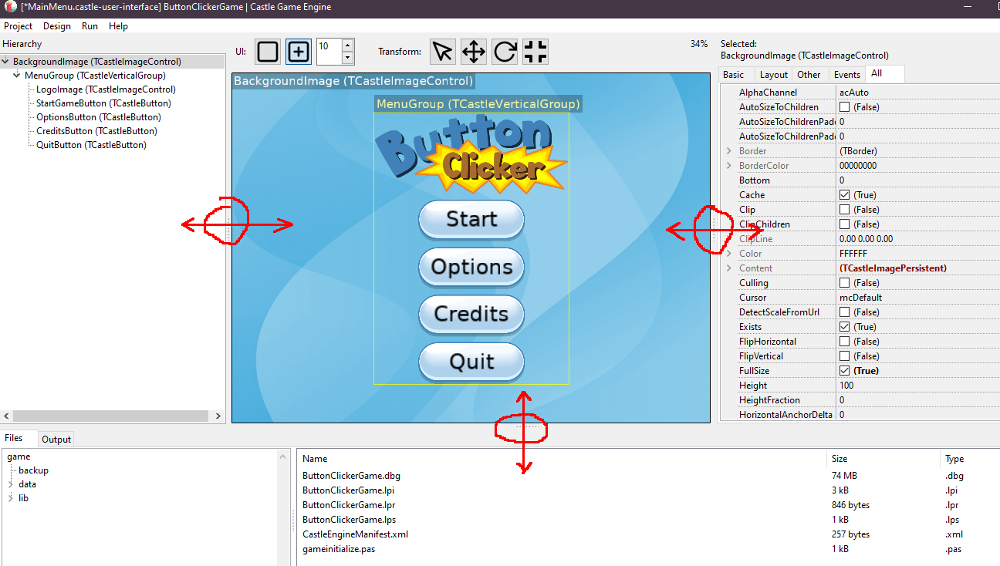

And we see that the design remains consistent no matter what screen resolution or aspect ratio we pick:

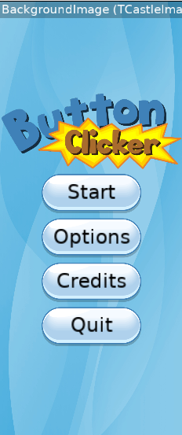

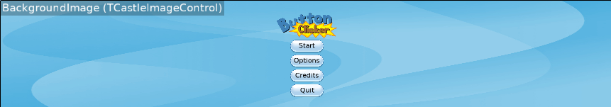

Now, why don't we use this feature to make our Castle Editor window layout more convenient? Let our game window indeed be something Portrait-like. Let's drag the lower separator straight to the bottom, we shan't be using anything from below in this tutorial:

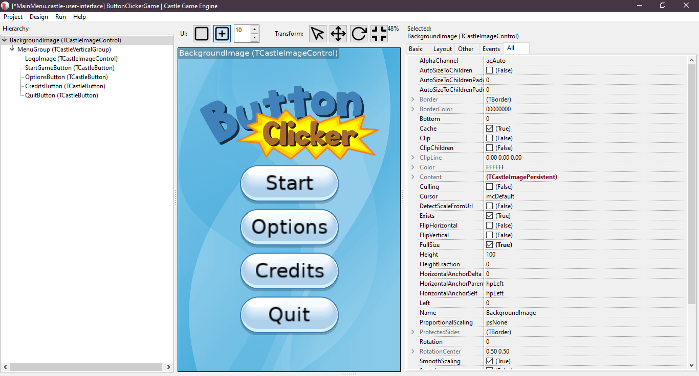

### Load the Main Menu in the game

Now as we have a ready Main Menu design, we need to use it in the game. Unfortunately at the moment it's still not possible to do that automatically and will require us to return to Lazarus.

First of all we need to create a unit for our new Game State. It's done by clicking File -> New Unit:

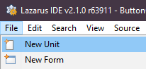

Now we've got an empty pascal unit with the first line containing its name: `unit Unit1;`. Let's change it to `unit GameStateMainMenu;` and save the file.

Let's add `CastleUiState` to `uses` section, like this:

```Pascal
uses
  Classes, SysUtils, CastleUiState; 
```

And create a dummy TStateMainMenu class right behind the `uses` section:

```Pascal
type
  TStateMainMenu = class(TUiState)
  end;
```

We should also create a singleton variable for this class, by adding right after the class definition:

```Pascal
var
  StateMainMenu: TStateMainMenu;
```

Now we need to create a `Start` procedure that will be run when this state is activated. This is a `virtual` procedure, present in ancestor class, therefore we have to `override` it and use `inherited` inside to call the inherited code from the ancestor which is in turn required for the state to operate properly. Now our class declaration will look like this:

```Pascal
type
  TStateMainMenu = class(TUiState)
  public
    procedure Start; override;
  end;
```

And we have to _implement_ this procedure in `Implementation` section below:

```Pascal
implementation

procedure TStateMainMenu.Start;
begin
  inherited;
  //here will be our code
end;
```

Next we have to load the specific design into our State:

```Pascal
procedure TStateMainMenu.Start;
var
  UiOwner: TComponent;
begin
  inherited;
  InsertUserInterface('castle-data:/MainMenu.castle-user-interface', FreeAtStop, UiOwner);
end;
```

Here we use `InsertUserInterface` procedure to insert our newly designed `MainMenu.castle-user-interface` design into this State. Here `castle-data:/` is a protocol that enables us to reference the `data` folder in a safe cross-platform way, so that it'll work on Desktop and iPhone equally well.

`FreeAtStop` is a `TComponent` class that will free every unit assigned to it when the State will call `Stop`.

`UiOwner` is a container for our design, that we can use to get references to its specific components.

Last but not least we should create our `StateMainMenu` class and set it as current. We can do it in the unit `gameinitialize` - in `ApplicationInitialize` procedure by adding two lines:

```Pascal
StateMainMenu := TStateMainMenu.Create(Application);
TUiState.Current := StateMainMenu; 
```

We also have to add the unit of the state to `gameinitialize`'s `uses` section:

```Pascal
uses SysUtils,
  CastleWindow, CastleScene, CastleControls, CastleLog, CastleFilesUtils,
  CastleUIControls, CastleApplicationProperties,
  GameStateMainMenu; 
```

Save, compile and run. Now we have our MainMenu successfully loaded in the game. More than that, the buttons react to mouse cursor hovering over them, and clicking.

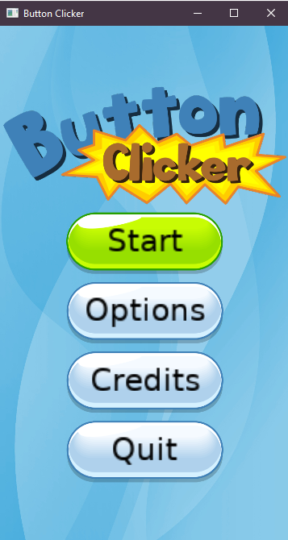

### Adding click events

Now we have to make those buttons actually perform some function. To do that we first have to "find" the button in the loaded design. Let's go back to `GameStateMainMenu` unit. First of all, let's create the variables for the buttons in our class, we'll also need to add `CastleControls` unit to the `uses` section:

```Pascal
uses
  Classes, SysUtils, CastleUiState, CastleControls;

type
  TStateMainMenu = class(TUiState)
  private
    StartGameButton, OptionsButton, CreditsButton, QuitButton: TCastleButton;
  public
    procedure Start; override;
  end;
```

Next we'll need to add `CastleComponentSerialize` unit to our `uses` section, let's add it after `implementation`. It will allow us to "find" the buttons by their names in the loaded design by calling:

```Pascal
implementation
uses
  CastleComponentSerialize;

procedure TStateMainMenu.Start;
var
  UiOwner: TComponent;
begin
  inherited;
  InsertUserInterface('castle-data:/MainMenu.castle-user-interface', FreeAtStop, UiOwner);
  StartGameButton := UiOwner.FindRequiredComponent('StartGameButton') as TCastleButton;
  OptionsButton := UiOwner.FindRequiredComponent('OptionsButton') as TCastleButton;
  CreditsButton := UiOwner.FindRequiredComponent('CreditsButton') as TCastleButton;
  QuitButton := UiOwner.FindRequiredComponent('QuitButton') as TCastleButton;
end;
```

Next we have to create dummy procedures that will be assigned to the buttons' click events:

```Pascal
type
  TStateMainMenu = class(TUiState)
  private
    StartGameButton, OptionsButton, CreditsButton, QuitButton: TCastleButton;
    procedure ClickStart(Sender: TObject);
    procedure ClickOptions(Sender: TObject);
    procedure ClickCredits(Sender: TObject);
    procedure ClickQuit(Sender: TObject);
  public
    procedure Start; override;
  end;
```

And their corresponding implementation:

```
procedure TStateMainMenu.ClickStart(Sender: TObject);
begin
end;

procedure TStateMainMenu.ClickOptions(Sender: TObject);
begin
end;

procedure TStateMainMenu.ClickCredits(Sender: TObject);
begin
end;

procedure TStateMainMenu.ClickQuit(Sender: TObject);
begin
end;
```

Lastly let's assign our buttons `OnClick` event to these procedures in the end of `Start`:

```Pascal
StartGameButton.OnClick := @ClickStart;
OptionsButton.OnClick := @ClickOptions;
CreditsButton.OnClick := @ClickCredits;
QuitButton.OnClick := @ClickQuit;
```

Now we may immediately implement the Quit button behavior by adding `CastleWindow` to `uses` section and calling `Application.MainWindow.Close` in the button click event:

```Pascal
procedure TStateMainMenu.ClickQuit(Sender: TObject);
begin
  Application.MainWindow.Close;
end; 
```

Now we can compile and test if this button is working as expected. We cannot implement the other buttons behavior yet, as we need to create corresponding game states.

For now let's add one more quality of life detail. On mobile platform we usually don't need "Quit" button, as the apps are closed by the operation system. So we should simply disable it in this case. We can do it by adding:

```Pascal
{$ifdef CASTLE_IOS}QuitButton.Enabled := false;{$endif}
{$ifdef ANDROID}QuitButton.Enabled := false;{$endif}
  ```

In a similar way as we did that when we forced the Window size on Desktop platforms.

### Set up Default font

Before we proceed, we need to improve how our fonts look. We shall be using two fonts in this game - the default one and the font for captions and buttons. Let's set up the Default font first. It can be done by adding font information to `CastleSettings.xml`:

```XML
<castle_settings>
  <ui_scaling
    mode="EncloseReferenceSize"
    reference_width="750"
    reference_height="1334"
  />
  <default_font>
    <regular
      url="fonts/CatV_6x12_9.ttf"
      size="30"
      anti_aliased="true"
    />
  </default_font>
</castle_settings>
```

This will make `CatV_6x12_9.ttf` a default font for the game, with `size` 30. We can immediately see that it looks better:

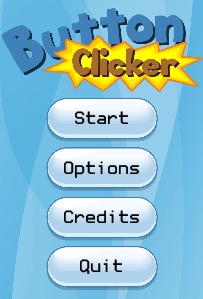

### Load and use a custom font

However, it's still blurry (because we requested font size 60 for the buttons, and the loaded font size is 30 - two times smaller) and it doesn't fit well into the design. Therefore, we'll be using a different font for button captions. There is no way to do that through Castle Editor yet, so let's load the font by code. In order to be easily able to reference the loaded alternative font, let's create a new unit and call it `GameFont` and make it have the following content:

```Pascal
unit GameFont;

{$mode objfpc}{$H+}

interface

uses SysUtils,
  CastleFonts;

var
  ButtonFont: TTextureFont;

procedure LoadFont;

implementation

procedure LoadFont;
begin
  ButtonFont := TTextureFont.Create('castle-data:/fonts/Big_Bottom_Cartoon.ttf', 60, true);
end;

finalization
  FreeAndNil(ButtonFont);
end.
```

This unit creates a variable ButtonFont with an alternative font `Big_Bottom_Cartoon.ttf` of size "60". We shall load it by calling `LoadFont` procedure, and it will be automatically freed upon the game end by calling `FreeAndNil(ButtonFont)` in `finalization` section.

Now let's add this unit to `GameInitialize` `uses` section and call `LoadFont;` before creating `StateMainMenu`.

The last step remaining is to assign this font to our buttons. To do this, add `GameFont` to the `uses` section and in the `Start` procedure write:

```Pascal
StartGameButton.CustomFont := ButtonFont;
OptionsButton.CustomFont := ButtonFont;
CreditsButton.CustomFont := ButtonFont;
QuitButton.CustomFont := ButtonFont;
```

And now our design finally looks almost as it was anticipated:

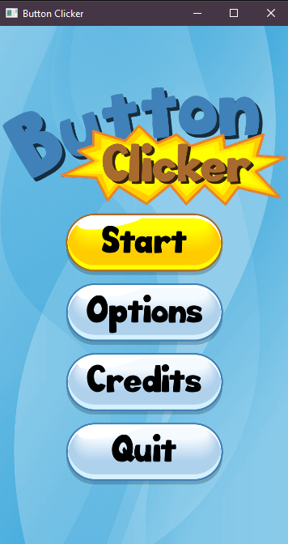

